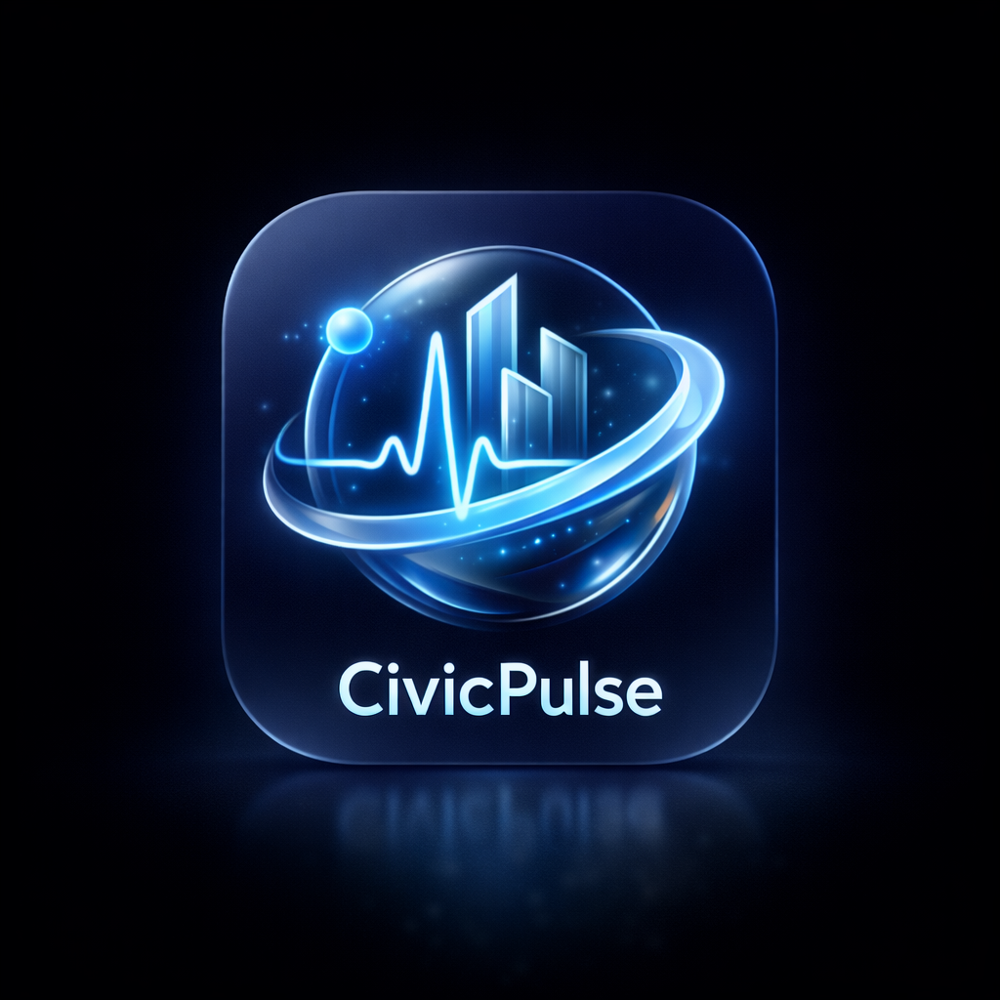
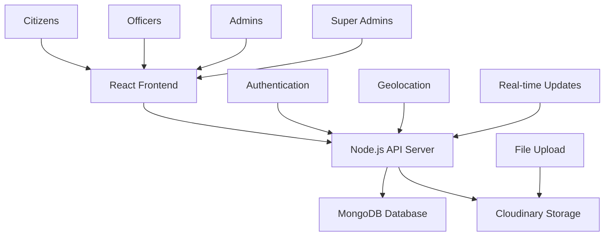

# CivicPulse 🏛️

<div align="center">
  
  
  **A Modern Civic Complaint Management System**
  
  *Empowering citizens, streamlining governance, building better communities*

[](https://reactjs.org/)
[](https://nodejs.org/)
[](https://mongodb.com/)
[](LICENSE)

</div>

---

## 📋 Table of Contents

- [Overview](#-overview)
- [Features](#-features)
- [Architecture](#-architecture)
- [Tech Stack](#-tech-stack)
- [Project Structure](#-project-structure)
- [Quick Start](#-quick-start)
- [User Roles](#-user-roles)
- [API Documentation](#-api-documentation)
- [Development](#-development)
- [Deployment](#-deployment)
- [Contributing](#-contributing)
- [License](#-license)

---

## 🌟 Overview

CivicPulse is a comprehensive civic complaint management system designed to bridge the gap between citizens and government services. Built with modern web technologies and featuring a stunning liquid glass UI design, it provides an intuitive platform for reporting, tracking, and resolving civic issues efficiently.

### 🎯 Mission

To create transparent, accountable, and efficient civic governance through technology-driven citizen engagement.

### 🚀 Vision

A world where every citizen has a voice in their community's development and every civic issue is addressed promptly and transparently.

---

## ✨ Features

### 🏠 **Citizen Portal**

- 📍 **Location-Based Reporting**: Report issues with precise GPS coordinates
- 📸 **Image Upload**: Attach up to 5 photos for better issue documentation
- 🔍 **Nearby Issues**: Discover and track community problems
- 📊 **Progress Tracking**: Real-time status updates with timeline
- 💬 **Feedback System**: Rate and review completed work
- 📱 **Mobile Responsive**: Seamless experience across all devices
- 🔐 **Self-Registration**: Citizens can register independently with sequential ID (CZ-XXXXXX)
- 🖼️ **Image Modal**: Click any image to view in full-screen modal with navigation

### 👮 **Field Officer Portal**

- 📋 **Task Dashboard**: Prioritized task management interface
- 🔄 **Status Updates**: Real-time progress reporting with images
- 📷 **Proof of Work**: Upload completion evidence (up to 5 images)
- 📈 **Performance Analytics**: Track work history and statistics
- 🎯 **Priority Management**: Focus on high-priority issues first
- ⏰ **Due Date Tracking**: Monitor deadlines and overdue tasks

### 🏢 **Department Admin Portal**

- 📊 **Analytics Dashboard**: Comprehensive performance metrics
- 👥 **Officer Management**: Create and manage field officer accounts
- 🎯 **Assignment System**: Intelligent task distribution with due dates
- 📈 **Reporting Tools**: Generate detailed performance reports
- ⚠️ **Escalation Management**: Handle overdue and critical issues
- ✅ **Verification**: Verify resolved complaints
- 🔄 **Reassignment**: Reassign tasks with reason tracking

### 🔧 **Super Admin Portal**

- 🌐 **System Overview**: City-wide analytics and monitoring
- 👤 **User Management**: Complete user lifecycle management
- 🏛️ **Department Setup**: Configure departments and zones
- ⚙️ **System Settings**: Global configuration management
- 📊 **Global Reports**: Export system-wide data and insights (CSV)
- 🔐 **Secure Access**: Hidden portal with multi-layer security
- 🔑 **Access Code Protection**: Requires secret code validation (frontend + backend)
- 📍 **Zone Management**: Geographic zone configuration with GeoJSON
- ✅ **Verification**: Verify resolved complaints

---

## 🏗️ Architecture



### 🔧 System Components

- **Frontend**: React 18 with liquid glass UI design and Redux state management
- **Backend**: Node.js with Express.js framework
- **Database**: MongoDB with Mongoose ODM and atomic counters
- **Storage**: Cloudinary for image management
- **Authentication**: JWT with role-based access control
- **Maps**: Leaflet.js for interactive mapping
- **State Management**: Redux Toolkit with optimized caching (60-70% fewer API calls)

---

## 💻 Tech Stack

### Frontend

| Technology        | Version | Purpose                      |
| ----------------- | ------- | ---------------------------- |
| React             | 18.2.0  | UI Framework                 |
| React Router      | 6.8.0   | Client-side routing          |
| Redux Toolkit     | 2.11.2  | State management             |
| React Redux       | 9.2.0   | Redux bindings               |
| React Hook Form   | 7.71.1  | Form management & validation |
| Styled Components | 6.3.8   | CSS-in-JS styling            |
| Axios             | 1.3.0   | HTTP client                  |
| Leaflet.js        | 1.9.3   | Interactive maps             |
| React Leaflet     | 4.2.0   | React bindings for Leaflet   |
| Framer Motion     | 12.34.0 | Animations                   |
| React Toastify    | 11.0.5  | Toast notifications          |
| React Select      | 5.10.2  | Enhanced dropdowns           |
| Font Awesome      | 7.1.0   | Icon library                 |

### Backend

| Technology    | Version | Purpose                  |
| ------------- | ------- | ------------------------ |
| Node.js       | 18.x    | Runtime environment      |
| Express.js    | 4.18.2  | Web framework            |
| MongoDB       | 8.0.4   | Database (Mongoose ODM)  |
| JWT           | 9.0.2   | Authentication           |
| Cloudinary    | 2.9.0   | Image storage & delivery |
| Multer        | 2.0.2   | File upload middleware   |
| Bcrypt.js     | 2.4.3   | Password hashing         |
| CSV Stringify | 6.6.0   | CSV export functionality |

---

## 📁 Project Structure

```
CivicPulse/
├── 📁 client/                 # React frontend application
│   ├── 📁 public/            # Static assets
│   │   ├── favicon.ico
│   │   ├── index.html
│   │   └── manifest.json
│   ├── 📁 src/
│   │   ├── 📁 components/    # Reusable UI components
│   │   │   ├── AccessGate/      # SuperAdmin access code gate
│   │   │   ├── Button/          # Reusable button component
│   │   │   ├── Card/            # Card component
│   │   │   ├── ConfirmationModal/ # Delete confirmation
│   │   │   ├── EditAssignmentModal/ # Edit assignments
│   │   │   ├── EditProfileModal/  # Profile editing
│   │   │   ├── EmptyState/      # Empty state UI
│   │   │   ├── Filter/          # Filtering component
│   │   │   ├── Forms/           # Form components
│   │   │   ├── Headers/         # Header & navigation
│   │   │   ├── ImageModal/      # Full-screen image viewer
│   │   │   ├── Layouts/         # Page layout components
│   │   │   ├── Loaders/         # Loading indicators
│   │   │   ├── Map/             # Leaflet map component
│   │   │   ├── Modal/           # Generic modal
│   │   │   ├── Pagination/      # Table pagination
│   │   │   ├── PriorityBadge/   # Priority indicators
│   │   │   ├── ProgressTimeline/ # Complaint timeline
│   │   │   ├── ReassignModal/   # Reassignment modal
│   │   │   ├── ScrollToTop/     # Scroll to top button
│   │   │   ├── StatCard/        # Statistics cards
│   │   │   ├── StatusBadge/     # Status indicators
│   │   │   ├── Table/           # Data table component
│   │   │   ├── Toast/           # Toast notifications
│   │   │   └── UserForm/        # User creation forms
│   │   ├── 📁 Pages/         # Application pages
│   │   │   ├── AboutUs/         # About page
│   │   │   ├── Admin/           # Admin portal pages
│   │   │   ├── Auth/            # Authentication pages
│   │   │   ├── Citizen/         # Citizen portal pages
│   │   │   ├── Contact/         # Contact page
│   │   │   ├── Home/            # Landing page
│   │   │   ├── NotFound/        # 404 page
│   │   │   ├── Officer/         # Officer portal pages
│   │   │   ├── SuperAdmin/      # SuperAdmin portal pages
│   │   │   └── Unauthorized/    # 401 page
│   │   ├── 📁 services/      # API service layer
│   │   │   ├── adminService.js
│   │   │   ├── api.js           # Axios instance
│   │   │   ├── citizenService.js
│   │   │   ├── officerService.js
│   │   │   └── superAdminService.js
│   │   ├── 📁 store/         # Redux store
│   │   │   ├── slices/          # Redux slices
│   │   │   ├── hooks.js         # Redux hooks
│   │   │   └── store.js         # Store configuration
│   │   ├── 📁 styles/        # Styling system
│   │   │   ├── animations.js    # Keyframe animations
│   │   │   ├── glassUtilities.js # Glass morphism
│   │   │   ├── GlobalStyles.js  # Global styles
│   │   │   ├── liquidGlass.js   # Liquid glass effects
│   │   │   ├── reactSelectStyles.js # Select styles
│   │   │   └── theme.js         # Theme configuration
│   │   ├── 📁 utils/         # Utility functions
│   │   │   ├── authStorage.js   # Auth token storage
│   │   │   ├── colorMapper.js   # Color utilities
│   │   │   ├── dateFormatter.js # Date formatting
│   │   │   ├── scrollReactiveLighting.js # Scroll effects
│   │   │   └── toast.js         # Toast utilities
│   │   ├── 📁 context/       # React contexts
│   │   │   └── authContext.js   # Auth context
│   │   ├── 📁 hooks/         # Custom hooks
│   │   │   ├── useImageModal.js # Image modal hook
│   │   │   └── useScrollAnimation.js # Scroll animation
│   │   ├── 📁 routes/        # Route configurations
│   │   │   ├── protectedRoute.jsx # Route guard
│   │   │   └── protectedRoutes.js # Route definitions
│   │   ├── 📁 Data/          # Static data
│   │   ├── App.jsx
│   │   └── index.js
│   ├── .env                # Environment variables
│   ├── package.json        # Frontend dependencies
│   └── README.md           # Frontend documentation
├── 📁 server/                # Node.js backend application
│   ├── 📁 controllers/       # Business logic
│   │   ├── admin/           # Admin controllers
│   │   ├── citizen/         # Citizen controllers
│   │   ├── general/         # Shared controllers
│   │   ├── officer/         # Officer controllers
│   │   └── superAdmin/      # SuperAdmin controllers
│   ├── 📁 models/            # Database schemas
│   │   ├── admin/           # Admin models
│   │   ├── citizen/         # Citizen models
│   │   ├── general/         # Shared models (Counter, Complaint, etc.)
│   │   ├── officer/         # Officer models
│   │   └── superAdmin/      # SuperAdmin models
│   ├── 📁 routes/            # API endpoints
│   │   ├── admin/           # Admin routes
│   │   ├── citizen/         # Citizen routes
│   │   ├── general/         # Shared routes
│   │   ├── officer/         # Officer routes
│   │   └── superAdmin/      # SuperAdmin routes
│   ├── 📁 middleware/        # Custom middleware
│   │   ├── authMiddleware.js # JWT authentication
│   │   ├── errorMiddleware.js # Error handling
│   │   ├── superAdminAccessMiddleware.js # Access code
│   │   └── uploadMiddleware.js # File upload
│   ├── 📁 config/            # Configuration files
│   │   ├── cloudinary.js    # Cloudinary config
│   │   └── db.js            # MongoDB connection
│   ├── 📁 utils/             # Helper functions
│   │   ├── authHelper.js    # Auth utilities
│   │   ├── cloudinaryHelper.js # Image upload
│   │   ├── generateEmployeeId.js # ID generation
│   │   ├── generateToken.js # JWT generation
│   │   ├── queryHelper.js   # Query builders
│   │   ├── userHelper.js    # User utilities
│   │   └── validationHelper.js # Validation
│   ├── 📁 scripts/           # Utility scripts
│   │   └── migrateTimeline.js # Data migration
│   ├── server.js           # Entry point
│   ├── .env                # Environment variables
│   ├── package.json        # Backend dependencies
│   └── README.md           # Backend documentation
├── .amazonq/               # Amazon Q rules
├── README.md               # This file
└── sample-complaints.json  # Sample data
```

---

## 🚀 Quick Start

### Prerequisites

- Node.js 18.x or higher
- MongoDB 6.x or higher
- npm or yarn package manager
- Cloudinary account (for image uploads)

### 1. Clone the Repository

```bash
git clone https://github.com/your-username/CivicPulse.git
cd CivicPulse
```

### 2. Backend Setup

```bash
cd server
npm install
cp .env.example .env
# Edit .env with your configuration
npm run server
```

### 3. Frontend Setup

```bash
cd ../client
npm install
cp .env.example .env
# Edit .env with your configuration
npm start
```

### 4. Create SuperAdmin Account

**⚠️ Important: SuperAdmin portal is hidden and secured**

```bash
# Navigate to hidden SuperAdmin portal
open http://localhost:3000/sys-admin-portal-x7k9m

# Step 1: Enter access code when prompted
# Get the code from your .env file: REACT_APP_SUPERADMIN_ACCESS_CODE
# (See ACCESS_CODE.md for how to find/change it)

# Step 2: After access granted, fill registration form:
# - Full Name
# - Email
# - Password (min 8 chars, 1 uppercase, 1 lowercase, 1 number, 1 special char)
# - Phone Number

# Your SuperAdmin ID will be auto-generated (SA-000001, SA-000002, etc.)
```

**🔒 Security Notes:**

- SuperAdmin NOT visible in role selection (`/login`)
- Requires access code (frontend AccessGate + backend middleware)
- 3 failed attempts = lockout + redirect
- Change access code in `.env` files for production
- See `ACCESS_CODE.md` for complete documentation

### 5. Access the Application

- **Frontend**: http://localhost:3000
- **Backend API**: http://localhost:8080
- **Database**: MongoDB running on default port 27017

---

## 👥 User Roles

<div align="center">

| Role               | ID Format | Access Level | Key Features                                                 |
| ------------------ | --------- | ------------ | ------------------------------------------------------------ |
| 🏠 **Citizen**     | CZ-XXXXXX | Basic        | Report issues, track complaints, view nearby problems        |
| 👮 **Officer**     | OF-XXXXXX | Field        | Manage assigned tasks, update status, upload proof           |
| 🏢 **Admin**       | AD-XXXXXX | Department   | Assign tasks, manage officers, generate reports              |
| 🔧 **Super Admin** | SA-XXXXXX | System       | Full system access (Hidden portal with access code security) |

</div>

### Sequential ID System

Each role has a unique, sequential ID format:

- **Citizens**: CZ-000001, CZ-000002, CZ-000003...
- **Officers**: OF-000001, OF-000002, OF-000003...
- **Admins**: AD-000001, AD-000002, AD-000003...
- **SuperAdmins**: SA-000001, SA-000002, SA-000003...

IDs are automatically generated during user registration and increment sequentially per role using MongoDB atomic counters for thread-safe operations.

---

## 📚 API Documentation

### Authentication Endpoints

```http
POST /api/auth/login                      # User login (all roles)
POST /api/citizens/register               # Citizen self-registration
POST /api/superadmin/verify-access        # Verify SuperAdmin access code
POST /api/superadmin/register             # SuperAdmin registration (requires access code header)
GET  /api/auth/me                         # Get current user
POST /api/auth/logout                     # User logout
```

### Complaint Management

```http
GET    /api/complaints        # Get complaints (filtered)
POST   /api/complaints        # Create new complaint
PUT    /api/complaints/:id    # Update complaint
DELETE /api/complaints/:id    # Delete complaint
GET    /api/complaints/nearby # Get nearby complaints
```

### User Management

```http
GET    /api/users            # Get users (admin only)
POST   /api/users            # Create user (admin only)
PUT    /api/users/:id        # Update user
DELETE /api/users/:id        # Delete user (admin only)
```

For complete API documentation, see [API Reference](./server/README.md#api-endpoints).

---

## 🔐 SuperAdmin Security

SuperAdmin access is protected with multiple security layers:

### **Hidden URLs**

- Login: `/sys-admin-portal-x7k9m`
- Register: `/sys-admin-register-x7k9m`
- NOT visible in role selection page (`/login`)

### **Access Code Protection**

- **Frontend**: AccessGate component validates code
- **Backend**: Middleware validates `x-admin-access-code` header
- **Lockout**: 3 failed attempts = redirect to home

### **Configuration**

```env
# client/.env
REACT_APP_SUPERADMIN_ACCESS_CODE=your_secure_code_here

# server/.env
SUPERADMIN_ACCESS_CODE=your_secure_code_here
```

### **Documentation**

- 📄 `ACCESS_CODE.md` - How to get and change access code
- 📄 `SUPERADMIN_SECURITY.md` - Complete security guide
- 📄 `client/src/components/AccessGate/WORKFLOW.md` - AccessGate workflow

---

## 🛠️ Development

### Code Style Guidelines

- **Frontend**: ESLint + Prettier configuration
- **Backend**: Node.js best practices with async/await
- **Database**: Mongoose schemas with validation
- **Git**: Conventional commit messages

### Development Workflow

1. Create feature branch from `main`
2. Implement changes with tests
3. Run linting and tests
4. Submit pull request
5. Code review and merge

### Testing

```bash
# Frontend tests
cd client && npm test

# Backend tests
cd server && npm test

# E2E tests
npm run test:e2e
```

---

## 🚀 Deployment

### Production Environment

#### Frontend (Vercel/Netlify)

```bash
cd client
npm run build
# Deploy build folder
```

#### Backend (Heroku/AWS)

```bash
cd server
# Set production environment variables
npm start
```

#### Database (MongoDB Atlas)

- Configure MongoDB Atlas cluster
- Update connection string in production

### Environment Variables

#### Frontend (.env)

```env
REACT_APP_API_BASE_URL=https://your-api-domain.com/api
```

#### Backend (.env)

```env
NODE_ENV=production
PORT=8080
MONGO_URI=<your_mongodb_connection_string>
JWT_SECRET=<your_jwt_secret>
CLOUDINARY_CLOUD_NAME=<your_cloudinary_name>
CLOUDINARY_API_KEY=<your_cloudinary_key>
CLOUDINARY_API_SECRET=<your_cloudinary_secret>
```

---

## 🤝 Contributing

We welcome contributions from the community! Please read our [Contributing Guidelines](CONTRIBUTING.md) before submitting pull requests.

### How to Contribute

1. Fork the repository
2. Create a feature branch
3. Make your changes
4. Add tests if applicable
5. Submit a pull request

### Code of Conduct

Please read our [Code of Conduct](CODE_OF_CONDUCT.md) to understand our community standards.

---

## 📄 License

This project is licensed under a Private License - see the [LICENSE](LICENSE) file for details.

---

## 📞 Support

For support and questions:

- 📧 Email: support@civicpulse.com
- 💬 Discord: [CivicPulse Community](https://discord.gg/civicpulse)
- 📖 Documentation: [docs.civicpulse.com](https://docs.civicpulse.com)

---

## 🙏 Acknowledgments

- Thanks to all contributors who have helped build CivicPulse
- Special thanks to the open-source community for the amazing tools and libraries
- Inspired by the need for better civic engagement and transparent governance

---

<div align="center">
  <p><strong>Built with ❤️ for better communities</strong></p>
  <p>© 2026 CivicPulse. All rights reserved.</p>
</div>
