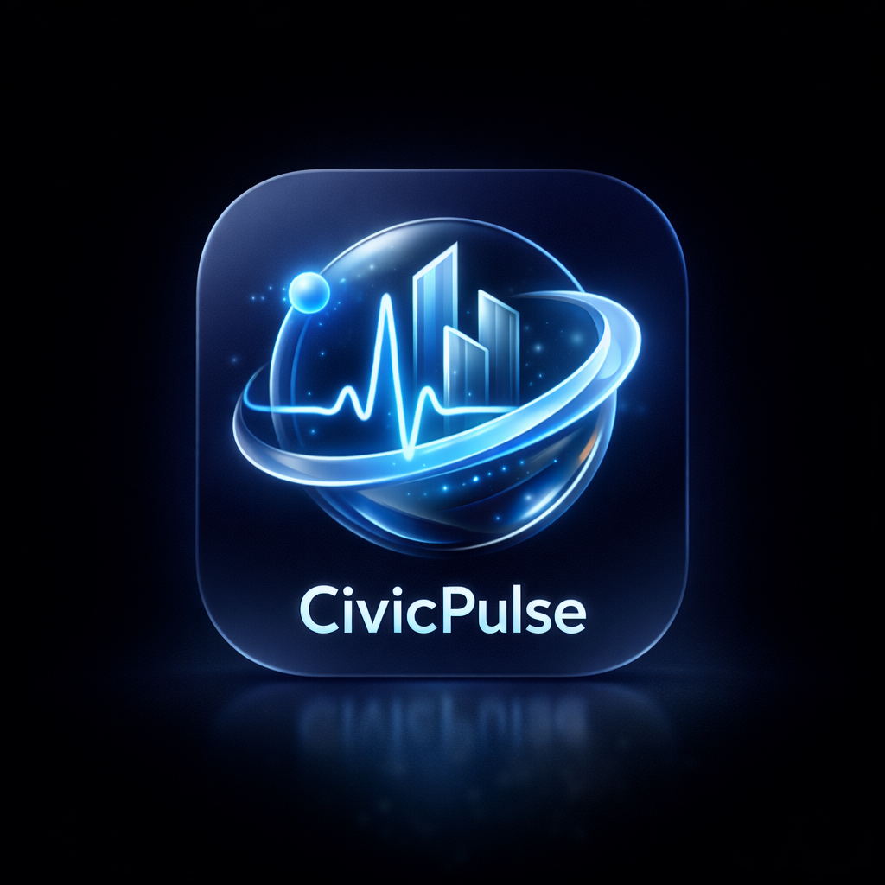

# CivicPulse

<div align="center">
  

  **A Modern Civic Complaint Management System**

  *Empowering citizens, streamlining governance, building better communities*

[](https://reactjs.org/)
[](https://nodejs.org/)
[](https://mongodb.com/)
[](https://vercel.com/)
[](https://render.com/)
[](LICENSE)

</div>

---

## Table of Contents

- [Overview](#overview)
- [Features](#features)
- [Architecture](#architecture)
- [Tech Stack](#tech-stack)
- [Project Structure](#project-structure)
- [Quick Start](#quick-start)
- [Make Commands](#make-commands)
- [Docker (Local Dev)](#docker-local-dev)
- [User Roles](#user-roles)
- [Deployment](#deployment)
- [Environment Variables](#environment-variables)
- [GitHub Secrets](#github-secrets)
- [API Overview](#api-overview)

---

## Overview

CivicPulse is a full-stack civic complaint management system that bridges the gap between citizens and government services. Citizens report issues, field officers resolve them, department admins oversee their zone, and a super admin manages the entire system.

**Live deployments:**
- Client → Vercel (React SPA)
- Server → Render (Express API + PM2)
- Database → MongoDB Atlas
- Images → Cloudinary

---

## Features

### Citizen Portal
- Location-based issue reporting with GPS coordinates
- Attach up to 5 photos per complaint
- Nearby issues map (Leaflet.js)
- Real-time status tracking with timeline
- Resolution feedback and rating
- Self-registration with sequential ID (`CZ-XXXXXX`)

### Field Officer Portal
- Prioritized task dashboard
- Progress updates with proof-of-work images
- Work history and performance stats
- Due date tracking

### Department Admin Portal
- Complaint assignment with due dates
- Officer management (create / update / delete)
- Reassignment with reason tracking
- Escalation management
- Department performance reports (CSV export)
- Resolution verification

### Super Admin Portal
- System-wide analytics and monitoring
- User lifecycle management across all roles
- Department and zone (GeoJSON) configuration
- Global reports and CSV export
- System settings management
- Hidden portal URL with access-code security

---

## Architecture

```
Citizens / Officers / Admins / SuperAdmins
               │
        React SPA (Vercel)
               │  HTTPS + Bearer token
      Express API (Render + PM2)
         │              │
   MongoDB Atlas     Cloudinary
```

**Key design decisions:**
- JWT stored in `localStorage` / `sessionStorage` and sent as `Authorization: Bearer` header — works across Vercel ↔ Render domains
- Cookie auth is a secondary fallback (HttpOnly, `SameSite: none`, `Secure` in production)
- PM2 in `fork` mode with `max_memory_restart: 450M` on Render's free 512 MB tier
- Redux Toolkit caching cuts API calls by ~60–70 %

---

## Tech Stack

### Frontend

| Package | Version | Purpose |
|---|---|---|
| React | 18.2.0 | UI framework |
| React Router DOM | 6.8.0 | Client-side routing |
| Redux Toolkit | 2.11.2 | State management |
| React Hook Form | 7.71.1 | Form validation |
| Styled Components | 6.3.8 | CSS-in-JS |
| Axios | 1.3.0 | HTTP client |
| Leaflet / React Leaflet | 1.9.3 / 4.2.0 | Interactive maps |
| Framer Motion | 12.34.0 | Animations |
| React Toastify | 11.0.5 | Toast notifications |
| React Select | 5.10.2 | Enhanced dropdowns |
| Font Awesome | 7.1.0 | Icons |

### Backend

| Package | Version | Purpose |
|---|---|---|
| Node.js | 20.x | Runtime |
| Express | 4.18.2 | Web framework |
| Mongoose | 8.0.4 | MongoDB ODM |
| jsonwebtoken | 9.0.2 | JWT auth |
| bcryptjs | 2.4.3 | Password hashing |
| Cloudinary | 2.9.0 | Image storage |
| Multer | 2.0.2 | File upload middleware |
| PM2 | 5.4.3 | Process manager (auto-restart) |
| csv-stringify | 6.6.0 | CSV export |

---

## Project Structure

```
CivicPulse/
├── .github/
│   └── workflows/
│       ├── ci.yml             # CI — install + build check on every push
│       └── keep-alive.yml     # Cron — pings Render /health every 14 min
├── client/                    # React SPA
│   ├── public/
│   ├── src/
│   │   ├── components/        # Reusable UI components
│   │   ├── Pages/             # Route-level page components
│   │   ├── services/          # Axios API service layer
│   │   ├── store/             # Redux store + slices
│   │   ├── styles/            # Theme, glass utilities, animations
│   │   ├── utils/             # Auth storage, date, toast helpers
│   │   ├── hooks/             # Custom React hooks
│   │   ├── routes/            # Protected route definitions
│   │   ├── context/           # Auth context
│   │   ├── Data/              # Static page data
│   │   ├── App.jsx
│   │   └── index.js
│   ├── .env.example
│   ├── vercel.json            # Vercel SPA rewrites
│   └── package.json
├── server/                    # Express REST API
│   ├── config/                # DB + Cloudinary setup
│   ├── controllers/           # Business logic (by role)
│   ├── middleware/            # Auth, error, upload, access-code
│   ├── models/                # Mongoose schemas (by role)
│   ├── routes/                # API route definitions (by role)
│   ├── scripts/               # One-off migration scripts
│   ├── utils/                 # Auth, token, ID generation helpers
│   ├── ecosystem.config.js    # PM2 process config
│   ├── nodemon.json           # Nodemon dev config
│   ├── Dockerfile             # Production Docker image
│   ├── .dockerignore
│   ├── .env.example
│   └── package.json
├── docker-compose.yml         # Local dev stack (MongoDB + API)
├── render.yaml                # Render deployment config
├── Makefile                   # Developer shortcuts
├── .nvmrc                     # Node.js 20
├── .gitignore
└── README.md
```

---

## Quick Start

### Prerequisites

- Node.js 20+ (`nvm use` picks it up from `.nvmrc`)
- npm 10+
- MongoDB Atlas account (or run Docker locally — see below)
- Cloudinary account

### 1. Clone

```bash
git clone https://github.com/your-username/CivicPulse.git
cd CivicPulse
nvm use          # switches to Node 20
```

### 2. Install dependencies

```bash
make install
# or manually:
# cd server && npm install
# cd client && npm install
```

### 3. Configure environment

```bash
cp server/.env.example server/.env
cp client/.env.example client/.env
# Fill in both .env files — see Environment Variables section below
```

### 4. Start development servers

```bash
make dev          # starts both client (:3000) and server (:8080) concurrently
# or separately:
make dev-server   # API only  (nodemon)
make dev-client   # React only
```

### 5. Create the first SuperAdmin

The SuperAdmin portal is deliberately hidden. Navigate to:

```
http://localhost:3000/sys-admin-portal-x7k9m
```

Enter the `REACT_APP_SUPERADMIN_ACCESS_CODE` from `client/.env`, then register. Your ID will be `SA-000001`.

### 6. URLs

| Service | URL |
|---|---|
| React client | http://localhost:3000 |
| Express API | http://localhost:8080 |
| API health | http://localhost:8080/health |
| MongoDB (Docker) | mongodb://localhost:27017 |

---

## Make Commands

```bash
make help           # list all commands

# Install
make install        # both workspaces
make install-server
make install-client

# Development
make dev            # client + server (requires concurrently)
make dev-server     # API only (nodemon)
make dev-client     # React only

# Production
make build          # React production build → client/build/
make start          # Express server with PM2 (production)
make migrate        # run timeline migration script (once after deploy)

# Docker
make docker-up      # start MongoDB + API containers
make docker-down    # stop containers
make docker-logs    # tail container logs

# Cleanup
make clean          # remove node_modules + build/
make clean-build    # remove client/build/ only
```

---

## Docker (Local Dev)

Spin up MongoDB + the Express API without installing MongoDB locally:

```bash
make docker-up
# API  → http://localhost:8080
# Mongo → mongodb://localhost:27017

# Then in a separate terminal:
cd client && npm start
```

The server container mounts `./server` as a volume and runs nodemon — code changes hot-reload automatically.

```bash
make docker-down    # stop and remove containers
make docker-logs    # follow logs
```

---

## User Roles

| Role | ID Format | Registration | Key Access |
|---|---|---|---|
| Citizen | `CZ-XXXXXX` | Self-register at `/citizen/register` | Report, track, view nearby issues |
| Officer | `OF-XXXXXX` | Created by Admin | Assigned tasks, progress updates |
| Admin | `AD-XXXXXX` | Created by SuperAdmin | Department complaints, officer management |
| SuperAdmin | `SA-XXXXXX` | Hidden portal `/sys-admin-portal-x7k9m` | Full system access |

IDs are generated sequentially using MongoDB atomic counters — thread-safe across concurrent registrations.

### SuperAdmin Security

- Login URL: `/sys-admin-portal-x7k9m` (not linked from anywhere)
- Register URL: `/sys-admin-register-x7k9m`
- Frontend: `AccessGate` component validates code before showing the form; 3 failed attempts redirect to home
- Backend: `superAdminAccessMiddleware` validates `x-admin-access-code` request header
- Both the client and server must have the **same** `SUPERADMIN_ACCESS_CODE` value

---

## Deployment

### Client → Vercel

1. Import the repo into Vercel, set **Root Directory** to `client`
2. Framework preset: **Create React App**
3. Add environment variables in the Vercel dashboard:
   ```
   REACT_APP_API_BASE_URL=https://your-api.onrender.com/api
   REACT_APP_SUPERADMIN_ACCESS_CODE=your_secure_code
   ```
4. Deploy — `client/vercel.json` handles SPA routing automatically

### Server → Render

1. Create a new **Web Service** on Render, connect the repo
2. Set **Root Directory** to `server`
3. Build command: `npm install`
4. Start command: `npm start` (runs PM2 via `ecosystem.config.js`)
5. Add all environment variables from the table below in the Render dashboard
6. `render.yaml` at the repo root can automate this via Render Blueprints

### Database → MongoDB Atlas

1. Create a free M0 cluster
2. Add a database user and whitelist `0.0.0.0/0` (or Render's static IPs)
3. Copy the connection string into `MONGO_URI`

### Keep-Alive (free tier)

Render's free tier sleeps after 15 minutes of inactivity. Two options:

**Option A — GitHub Actions** (already configured in `.github/workflows/keep-alive.yml`):
- Pings `/health` every 14 minutes
- Requires the `RENDER_API_URL` GitHub secret

**Option B — UptimeRobot** (more reliable, recommended):
- Sign up free at [uptimerobot.com](https://uptimerobot.com)
- Add HTTP monitor → URL: `https://your-api.onrender.com/health`
- Interval: 5 minutes

---

## Environment Variables

### Server (`server/.env`)

| Variable | Required | Description |
|---|---|---|
| `NODE_ENV` | Yes | `development` or `production` |
| `PORT` | Yes | Server port (`8080` local, `10000` on Render) |
| `MONGO_URI` | Yes | MongoDB Atlas connection string |
| `MONGO_DB_NAME` | Yes | Database name (e.g. `CivicPulse`) |
| `JWT_SECRET` | Yes | Long random string for signing tokens |
| `FRONTEND_URL` | Yes | Full client URL for CORS (e.g. `https://civicpulse.vercel.app`) |
| `CLOUDINARY_CLOUD_NAME` | Yes | From Cloudinary dashboard |
| `CLOUDINARY_API_KEY` | Yes | From Cloudinary dashboard |
| `CLOUDINARY_API_SECRET` | Yes | From Cloudinary dashboard |
| `SUPERADMIN_ACCESS_CODE` | Yes | Secret code for SuperAdmin portal |

### Client (`client/.env`)

| Variable | Required | Description |
|---|---|---|
| `REACT_APP_API_BASE_URL` | Yes | Full API URL + `/api` (e.g. `https://your-api.onrender.com/api`) |
| `REACT_APP_SUPERADMIN_ACCESS_CODE` | Yes | Must match server `SUPERADMIN_ACCESS_CODE` |

---

## GitHub Secrets

Go to **repo → Settings → Secrets and variables → Actions**:

| Secret | Value |
|---|---|
| `RENDER_API_URL` | `https://your-app.onrender.com` (no trailing slash) |
| `REACT_APP_API_BASE_URL` | `https://your-app.onrender.com/api` |
| `REACT_APP_SUPERADMIN_ACCESS_CODE` | Same value as server `SUPERADMIN_ACCESS_CODE` |

---

## API Overview

```
GET  /health                              # Health check (Render + keep-alive)

POST /api/citizens/register               # Citizen self-registration
POST /api/citizens/login                  # Citizen login
POST /api/auth/login                      # Officer / Admin login
GET  /api/auth/me                         # Current user
POST /api/auth/logout                     # Logout

POST /api/superadmin/verify-access        # Validate access code
POST /api/superadmin/register             # SuperAdmin registration
POST /api/superadmin/login                # SuperAdmin login

GET|POST        /api/complaints           # List / create complaints
GET|PUT|DELETE  /api/complaints/:id       # Read / update / delete
GET             /api/complaints/nearby    # Geo-filtered nearby complaints

GET|POST        /api/admin/officers       # Officer management
POST            /api/admin/complaints/:id/assign   # Assign to officer
POST            /api/admin/complaints/:id/verify   # Verify resolution

GET             /api/superadmin/users     # All users
GET             /api/superadmin/reports/export  # CSV export
GET             /api/superadmin/monitoring      # System stats

GET|POST|PUT|DELETE /api/departments      # Department CRUD
GET|POST|PUT|DELETE /api/superadmin/zones # Zone CRUD (GeoJSON)
GET|PUT             /api/settings         # System settings
```

Full endpoint reference: [server/README.md](server/README.md#api-endpoints)

---

<div align="center">
  <p>Built with care for better communities</p>
  <p>© 2026 CivicPulse. All rights reserved.</p>
</div>
